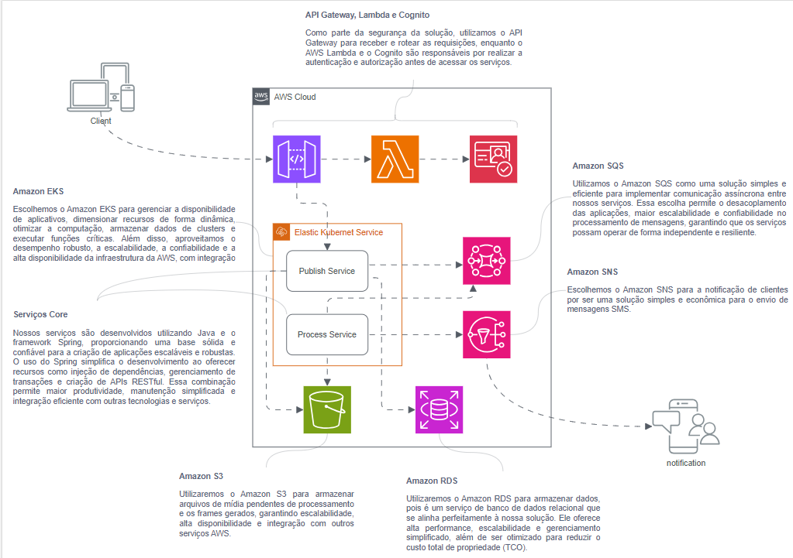
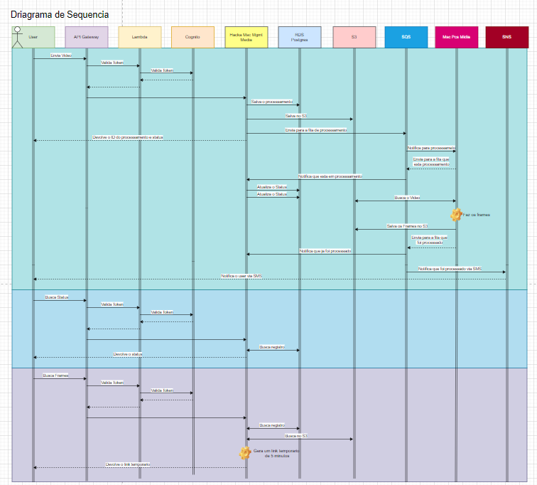
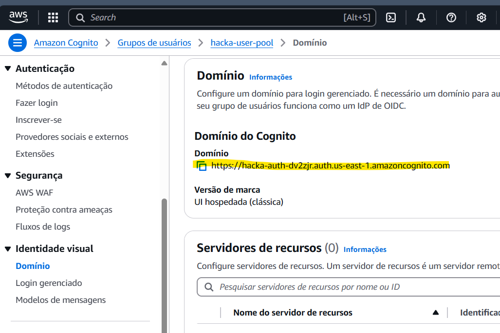
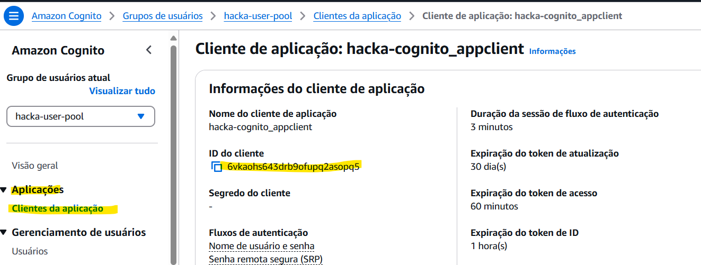

## Hi there 👋

## Resumo do Projeto

Este projeto é parte do MBA da FIAP e envolve a criação de uma infraestrutura na AWS utilizando Terraform, incluindo a configuração de VPC, EKS, RDS, API Gateway e Lambda. A aplicação principal é uma API de gerenciamento de pedidos desenvolvida em Java, que é implantada em um cluster Kubernetes.

Todo provisionamento foi feito asssumindo-se que AWS Academy está sendo utilizado.  AWS Academy não permite a criação de IAM roles ou qualquer outro recurso relacioado a AWS IAM. Sendo assim, em todos os módulos é utilizado o role LabRole pre-existente na AWS Academy.

Abaixo contem as duas fases do projeto, a primeira é o Hackathon e a segunda é o Tech Challenge.

# Fases Hackathon

### Video de apresentação do hackathon
//todo adicionar video

### Obs: Todos os projetos referente a essa fase do Hackathon são os repositorios que iniciam com o nome "hacka"

### Diagrama de Arquitetura

Abaixo está o diagrama de arquitetura do projeto, que ilustra a estrutura e os componentes principais da aplicação:


### Link: [Event Storming - Processamento De Arquivos](https://miro.com/app/board/uXjVKXjixqA=/?share_link_id=332305603387)

### Documentação do Projeto
[Documentação do Projeto Hackathon FIAP X.pdf](../entrega/Documenta%C3%A7%C3%A3o%20do%20Projeto%20Hackathon%20FIAP%20X.pdf)

### Drianagrama de sequencia

[hackaton.drawio](../entrega/hackaton.drawio)

## Passo a Passo para Subir Tudo via Pipeline espere sempre uma pipe terminar para executar a outra

### 1. Infra [Hacka Infra EKS](https://github.com/Fiap-6SOAT-GRUPO-21/hacka-infra-eks)

1. **Inicialize o laboratório no AWS Academy.**
2. **Crie um bucket S3** para armazenar o estado do Terraform. O nome do bucket deve ser "bucketterraformfiap". Ou altere o nome do bucket nas secrets da organização (AWS_BUCKET_NAME).
3. **Crie um bucket s3** para armazenar os videos a serem processados. O nome do bucket deve ser "media-files-002". Ou altere o nome do bucket nas secrets da organização (HACKA_BUCKET_NAME_MEDIA_FILES).
3. **Atualize as secrets da organização** com as credenciais obtidas no AWS Academy.
4. **Execute o pipeline de infraestrutura**:
   - O pipeline irá executar `terraform apply` para provisionar a VPC e o cluster EKS.
5. **Configure as credenciais do cluster EKS** na sua máquina:
   ```bash
   aws eks --region us-east-1 update-kubeconfig --name hacka

### 2. RDS [Hacka RDS](https://github.com/Fiap-6SOAT-GRUPO-21/hacka-infra-rds)

1. **Execute o pipeline de RDS**:
   - O pipeline irá executar `terraform apply` para provisionar a instância de RDS.
2. **Configure as credenciais do cluster EKS** na sua máquina:

### 3. Amazon- SQS [Hacka Amazon-SQS](https://github.com/Fiap-6SOAT-GRUPO-21/hacka-infra-sqs)

1. **Execute o pipeline de SQS** espere a pipe terminar para executar a prox:
   - O pipeline irá executar os comandos de kubectl apply para subir a aplicação.
2. **Com isso ja é possivel rodar os comandos de kubectl local**:

### 4. API: [Hacka Msc Mgmt Media](https://github.com/Fiap-6SOAT-GRUPO-21/hacka-msc-mgmt-media)

1. **Execute o pipeline de hacka-msc-mgmt-media** espere a pipe terminar para executar a prox:
   - O pipeline irá executar os comandos de kubectl apply para subir a aplicação.
2. **Com isso ja é possivel rodar os comandos de kubectl local**:

### 5. API: [Hacka Msc Pcs Midia](https://github.com/Fiap-6SOAT-GRUPO-21/hacka-msc-pcs-midia)

1. **Execute o pipeline de hacka-msc-pcs-midia**:
   - O pipeline irá executar os comandos de kubectl apply para subir a aplicação.
2. **Com isso ja é possivel rodar os comandos de kubectl local**:

### 7. Cognito [Hacka Cognito](https://github.com/Fiap-6SOAT-GRUPO-21/hacka-infra-cognito)

1. **Execute o pipeline do Cognito** espere a pipe terminar para executar a prox****:
   - O pipeline irá executar `terraform apply` para provisionar o cognito.

### 8. Authorizer lambda [Hacka Authorizer Lambda](https://github.com/Fiap-6SOAT-GRUPO-21/hacka-lambda-authorized)

1. **Execute o pipeline do authorizer-lambda** espere a pipe terminar para executar a prox:
   - O pipeline irá executar `terraform apply` para provisionar a lambda de authenticação.


### 9. API Gateway [Hacka API Gateway](https://github.com/Fiap-6SOAT-GRUPO-21/hacka-infra-api-gateway)

1. **Execute o pipeline de API Gateway**:
   - O pipeline irá executar `terraform apply` para provisionar o API Gateway.

## Utils

1. **configurar o aws cli**:
- aws eks --region us-east-1 update-kubeconfig --name techchallenge

2. **obter o endereço do api gateway**:
- aws apigatewayv2 get-apis

3. **Montar url para realizar login no cognito**:
- https://<url_do_cognito>/login?response_type=code&client_id=<client_id>&redirect_uri=https://google.com
- url_do_cognito = Entrar na aws na aba Cognito na lateral selecionar Dominio, em Domínio do Cognito

- client_id = Entrar na aws na aba Cognito na aba lateral selecionar Aplicações/Clientes da aplicação. Selecionar a aplicação e copiar o ID do cliente



3. **Login no Cognito com usuario defautl**:
- username     = "+5517996197451"
- password     = "Teste123!"

3. **Obter Token**:
   - Ao ser redirecionado para o google ira um parametro "CODE" chame a req abaixo para obter o token
   - curl --location 'https://url_do_cognito/oauth2/token' \
     --header 'Content-Type: application/x-www-form-urlencoded' \
     --data-urlencode 'grant_type=authorization_code' \
     --data-urlencode 'code=CODE' \
     --data-urlencode 'redirect_uri=https://google.com' \
     --data-urlencode 'client_id=client_id'

4. **Todas as req é nescessario passar authorization retornado do passo 3**:

5. **As API de MSC Mgmt Media e MSC Pcs Midia possuem um path default para acessar sendo eles**:
    - MSC Mgmt Media: /mgmt-media
    - MSC Pcs Midia: /pcs-midia

6. **Urls de healthcheck das API**:
    - MSC Mgmt Media: https://<url_do_api_gateway-Passo-2>/mgmt-media/actuator/health
    - MSC Pcs Midia: https://<url_do_api_gateway-Passo-2>/pcs-midia/actuator/health

## Não esqueca de executar a pipe de Terraform Destroy localizado no repo de "infra" no qual destroy todos os recusos criados
### [Pipe de Destroy](https://github.com/Fiap-6SOAT-GRUPO-21/hacka-infra-eks/actions/workflows/destroy.yml)


# Fases Tech Challenge

### Diagrama de Arquitetura (Fase 2)

Abaixo está o diagrama de arquitetura do projeto, que ilustra a estrutura e os componentes principais da aplicação:


### Video de apresentação da arquitetura do projeto (Fase 2)

[](https://www.youtube.com/watch?v=7pZ2tByl9t8)

### Video de apresentação da arquitetura do projeto (Fase 3)

[](https://youtu.be/MuOje_GppsU)

### Estrutura do banco de dados (Fase 3)


### Documentação do banco de dados (Fase 3)

[PostgreSQL e RDS.pdf](..%2Fpdf%2FPostgreSQL%20e%20RDS.pdf)

### Video de apresentação do projeto (Fase 4)

[](https://www.youtube.com/watch?v=NqZXG8bX308)

### Tecnologias Utilizadas

- **Java 21**
- **Maven 3.8.6**
- **Spring Boot**
- **Hibernate**
- **ModelMapper**
- **Docker**
- **Kubernetes**
- **Postgres**
- **Terraform**
- **AWS**
- **API Gateway**
- **Lambda**
- **Cognito**
- **RDS**
- **VPC**

## Passo a Passo para Subir Tudo via Pipeline espere sempre uma pipe terminar para executar a outra

### 1. Infra [Tech Challenge Infra EKS](https://github.com/Fiap-6SOAT-GRUPO-21/infra)

1. **Inicialize o laboratório no AWS Academy.**
2. **Crie um bucket S3** para armazenar o estado do Terraform. O nome do bucket deve ser "bucketterraformfiap". Ou altere o nome do bucket nas secrets da organização.
3. **Atualize as secrets da organização** com as credenciais obtidas no AWS Academy.
4. **Execute o pipeline de infraestrutura**:
   - O pipeline irá executar `terraform apply` para provisionar a VPC e o cluster EKS.
5. **Configure as credenciais do cluster EKS** na sua máquina:
   ```bash
   aws eks --region us-east-1 update-kubeconfig --name techchallenge

### 2. RDS [Tech Challenge RDS](https://github.com/Fiap-6SOAT-GRUPO-21/rds)

1. **Execute o pipeline de RDS**:
   - O pipeline irá executar `terraform apply` para provisionar a instância de RDS.
2. **Configure as credenciais do cluster EKS** na sua máquina:

### 4. MongoDB Atlas [Tech Challenge MongoDB Atlas](https://github.com/Fiap-6SOAT-GRUPO-21/mongoBD-atlas)

1. **Execute o pipeline do MongoDb-Atlas**:
   - O pipeline irá executar `terraform apply` para provisionar a instância de RDS.
2. Este é o unico recurso que não é destruido no pipeline de destroy do infra, para destruir rode o pipeline de destroy do MongoDb-Atlas:

### 3. API FOOD [Tech Challenge API FOOD](https://github.com/Fiap-6SOAT-GRUPO-21/api-food)

1. **Execute o pipeline de API FOOD** espere a pipe terminar para executar a prox:
   - O pipeline irá executar os comandos de kubectl apply para subir a aplicação.
2. **Com isso ja é possivel rodar os comandos de kubectl local**:     

### 5. API ORDER [Tech Challenge API ORDER](https://github.com/Fiap-6SOAT-GRUPO-21/api-order)

1. **Execute o pipeline de API ORDER**:
   - O pipeline irá executar os comandos de kubectl apply para subir a aplicação.
2. **Com isso ja é possivel rodar os comandos de kubectl local**:

### 6. API PAYMENTS [Tech Challenge API PAYMENTS](https://github.com/Fiap-6SOAT-GRUPO-21/api-payments)

1. **Execute o pipeline de API PAYMENTS**:
   - O pipeline irá executar os comandos de kubectl apply para subir a aplicação.
2. **Com isso ja é possivel rodar os comandos de kubectl local**:     

### 7. Cognito [Tech Challenge Cognito](https://github.com/Fiap-6SOAT-GRUPO-21/cognito)

1. **Execute o pipeline do Cognito** espere a pipe terminar para executar a prox****:
   - O pipeline irá executar `terraform apply` para provisionar o cognito.

### 8. Authorizer lambda [Tech Challenge Authorizer Lambda](https://github.com/Fiap-6SOAT-GRUPO-21/authorizer-lambda)

1. **Execute o pipeline do authorizer-lambda** espere a pipe terminar para executar a prox:
   - O pipeline irá executar `terraform apply` para provisionar a lambda de authenticação.


### 9. API Gateway [Tech Challenge API Gateway](https://github.com/Fiap-6SOAT-GRUPO-21/api-gateway)

1. **Execute o pipeline de API Gateway**:
   - O pipeline irá executar `terraform apply` para provisionar o API Gateway.

## Utils

1. **configurar o aws cli**:
  - aws eks --region us-east-1 update-kubeconfig --name techchallenge

2. **obter o endereço do api gateway**:
  - aws apigatewayv2 get-apis

3. **Montar url para realizar login no cognito**:
  - https://<url_do_cognito>/login?response_type=code&client_id=<client_id>&redirect_uri=https://google.com
  - url_do_cognito = Entrar na aws na aba Cognito na aba de Integração da aplicação, em Domínio do Cognito
  - client_id = Entrar na aws na aba Cognito na aba de Integração da aplicação, em Análise e clientes de aplicação
   
3. **Login no Cognito com usuario defautl**:
  - username     = "Teste"
  - password     = "Teste123!"

3. **Obter Token**:
   - Ao ser redirecionado para o google ira um parametro "CODE" chame a req abaixo para obter o token
   - curl --location 'https://url_do_cognito/oauth2/token' \
      --header 'Content-Type: application/x-www-form-urlencoded' \
      --data-urlencode 'grant_type=authorization_code' \
      --data-urlencode 'code=CODE' \
      --data-urlencode 'redirect_uri=https://google.com' \
      --data-urlencode 'client_id=client_id'

4. **Todas as req é nescessario passar authorization retornado do passo 3**:

## Não esqueca de executar a pipe de Terraform Destroy localizado no repo de "infra" no qual destroy todos os recusos criados menos o MongoDB Atlas que deve ser destruido pelo pipeline de destroy do MongoDb-Atlas dentro do repo de "mongodb-atlas"


